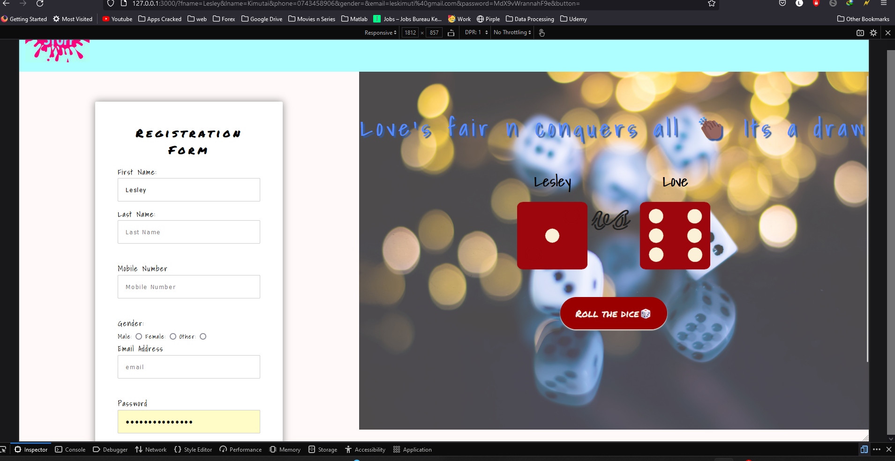
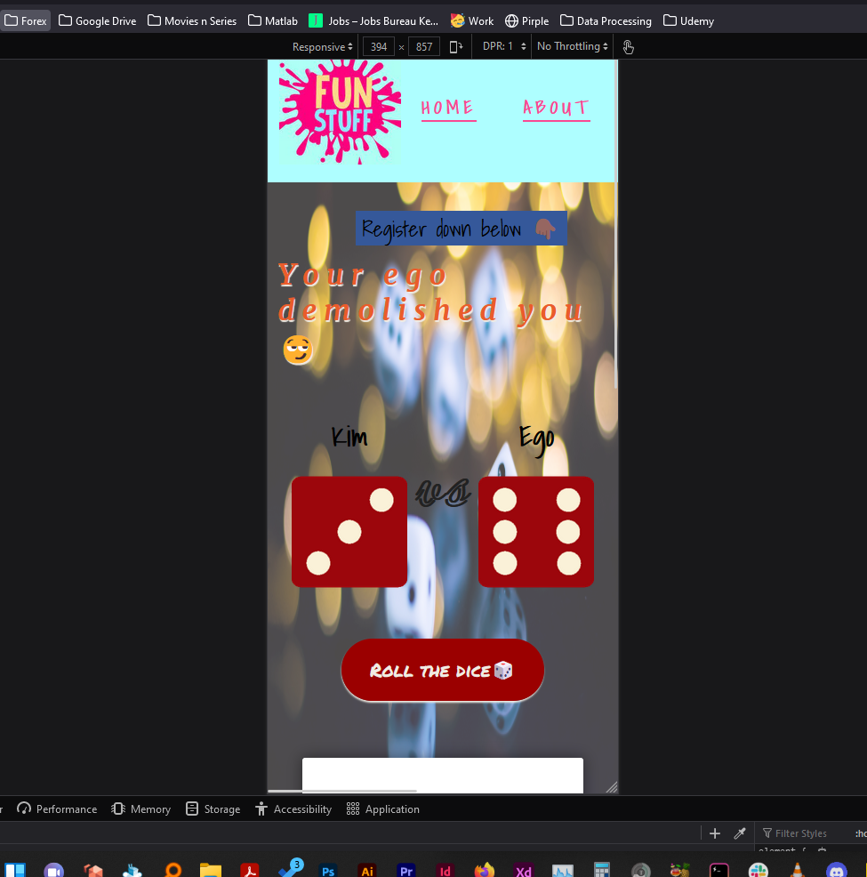
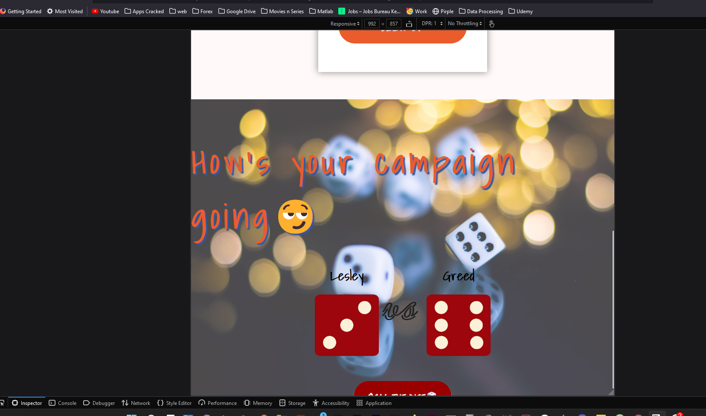
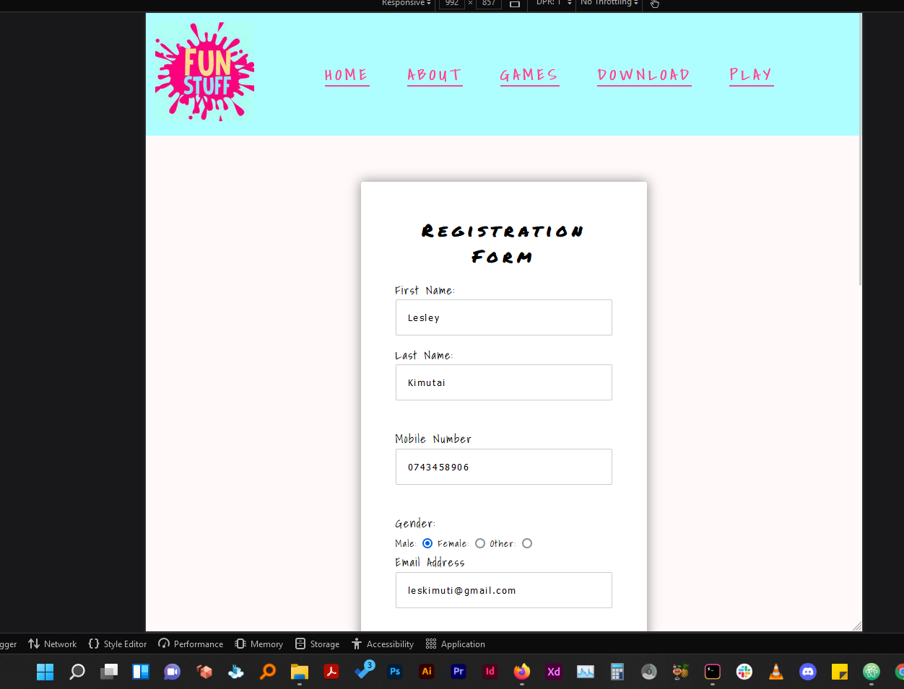

# eMobilis - First Assignment(Form + 7 Deadly Sins Dice Roll)

This is a solution to my first eMobilis Expolorer class Assignment
I decided to have a form that takes in most user details but mainly focused on the first name for the other part of the project (Dice roll 🎲) to work.

## Table of contents

- [Overview](#overview)
  - [The challenge](#the-challenge)
  - [Screenshot](#screenshot)
  - [Links](#links)
- [My process](#my-process)
  - [Built with](#built-with)
  - [What I learned](#what-i-learned)
  - [Continued development](#continued-development)
  - [Useful resources](#useful-resources)
- [Author](#author)
- [Acknowledgments](#acknowledgments)

## Overview

### The challenge

Users should be able to:

- Sign up on the registration form with `email`, `name`, and `password` fields were required.
- See their `first name` pop up as the first player on the dice roll against one of the `7 deadly sins💀`
- I have `love` somewhere in there too so not all deadly
- Roll the dice against the randomly selected sin with some love😂
- Have the h2 change with respect to who won N/B(Don't mind the messages, I'm no writer)
- See hover states for all interactive elements on the page
- That's all I had will probably add more stuff on the other links too
- Anyone with something fun to try out ... give a shout and lets get it in 🤙


### Screenshot

##### Laptop + Greater Screens Design :-



- Above is the laptop design of the site☝🏽

##### Mobile Design :-

<!--  -->

- Will try this later on was fully engrossed with making it work first 🏽

##### Tablet Design :-




- Above is the tablet designs of the site☝🏽
- Not as good as the laptop -- the side-by-side is just 💯


### Links

- Live Site/Netlifly URL: [Live Site](https://emobilis-dicegame.netlify.app/)
- Hosted with Netlify: [Netlify](https://www.netlify.com/)
- Solution URL: [GitHub Link ](https://github.com/eMobilis-Explorer/funwithdice.git)

## My process

- Started first with boiler plate html adding the form
- Customized the Form styling -- was nice
- Dove into the `.play_guess` next and styled that too before finally
- Used flex for the two `main` items - form, game
- Taking a whole load of hours adding the challenge functionalities ... was fun though
- Wrote out my process😂

### Built with

- Semantic HTML5 markup
- CSS custom properties
- Flexbox
- Laptop-first workflow
- Javascript


### What I learned

- IF statements are really tricky when they chose to be ... played with all kinds of possibilities, glad it worked in the end, got a bunch of uncommented codes due to this

- The ::before, and::after stylings take a different syntax of selection to be able to work on individual elements ...had a straight line going through the whole navigation part before I got this working
```css
.nav_item a.nav_link::before {
  /* That a.nav_link::before is what I'm talking about --selected it as .nav_link::before (that made a continuous line through navigation even with the height specified) */
  position: absolute;
  width: 100%;
  height: 2px;
  content: '';
  bottom: 0;
  left: 0;
}

```

### Continued development


 - Image Handling - Still struggling whether to add it in HTML markup or in css
 - Javascript - Took a bit long in this part, doesn't come as easily as CSS or HTML but with practice practice praaaacc.... will get there
 - Pretty pleased though with how it turned out


### Useful resources


- [W3Schools](https://www.w3schools.com/css/css3_backgrounds.asp) - Do you really need to know this ? ... probably not --- went here for all things challenging, got help mostly immediately -- time saver this💪🏾

## Author

- Website - [Lesley Kimutai](https://linktr.ee/les_kim)
- Frontend Mentor - [Leskim](https://www.frontendmentor.io/profile/Leskim)
- GitHub - [Leskim](https://github.com/Leskim)


## Acknowledgments

 - CODEPEN > [@EvyatarDa]
 - Loved this pen on navigation, did mine wholly from this guy/dame (not really sure) [@EvyatarDa](https://codepen.io/EvyatarDa/pen/waKXMd)
